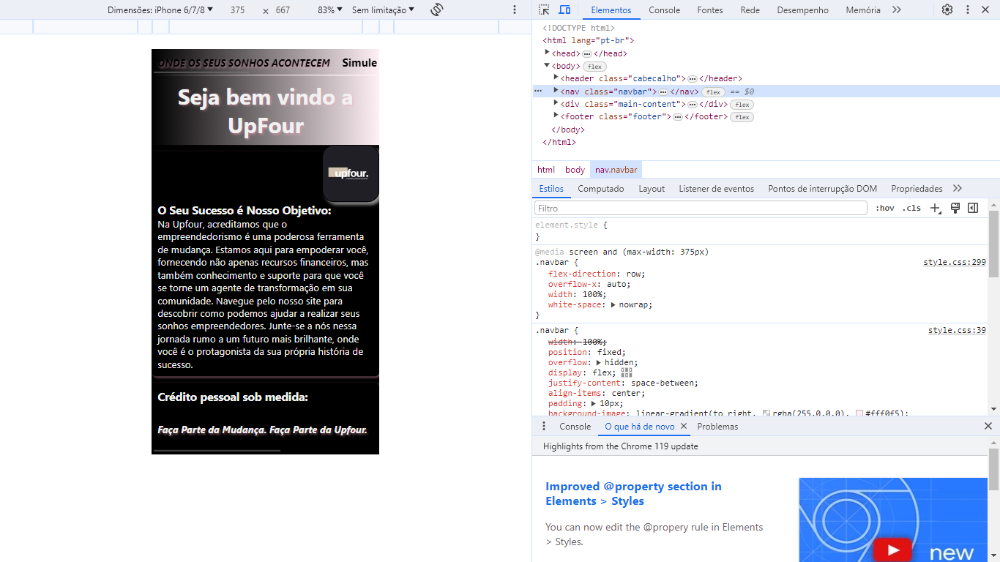
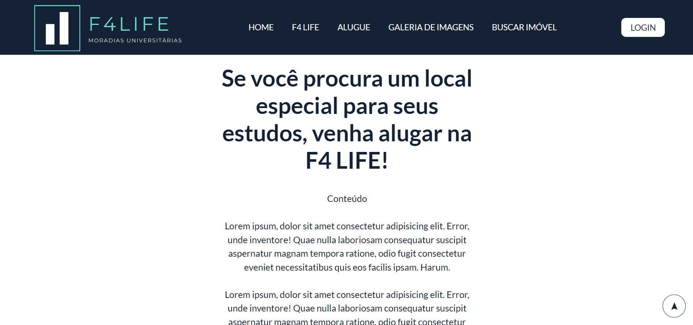
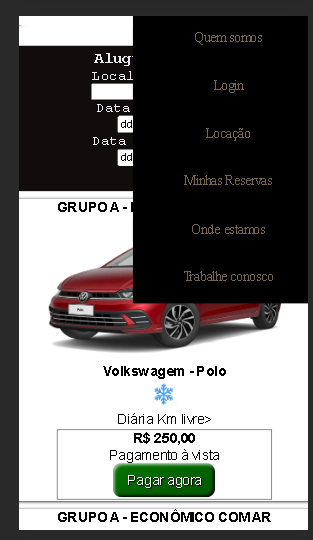
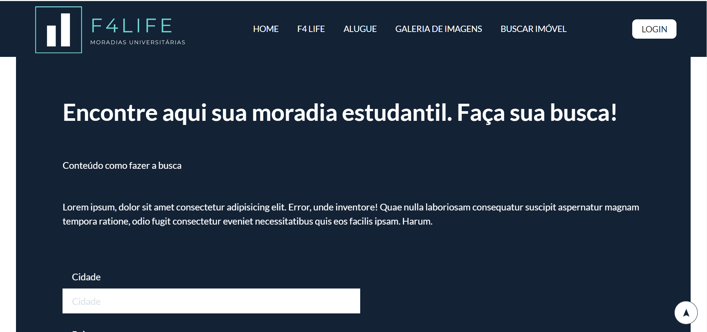
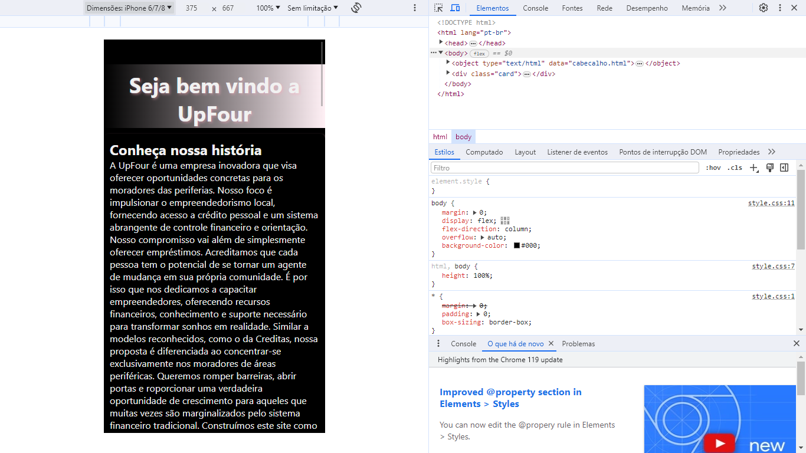
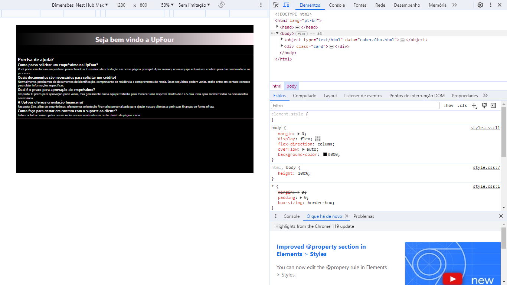
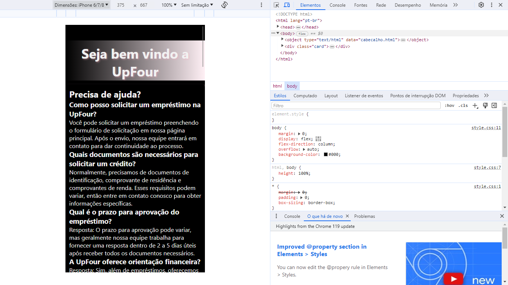

# UPFOUR

LINK DO SURGE: combative-fold.surge.sh

## Principais funcionalidades: 

barra de navegação com botões que vão para a sua respectiva página. ao passar o mouse em cima, os botões mudam de cor.
footer com informações de local e redes sociais.
quando passa o mouse por cima do texto do card, o fundo do cartão ilumina. 
a página de cadastro tem a função do DOM para obter os dados, validar o cadastro e apagar os dados após o alert.

## versão desktop e mobile 

 

 

 

 

obs.: para a navbar e o footer, adicionei uma barra de rolagem para a horizontal, assim ela fica do tamanho normal 
sem precisar cortar o texto da página. e quando necessário adicionei uma barra de rolagem vertical.

